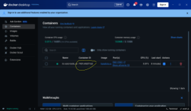
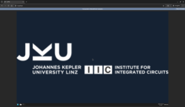
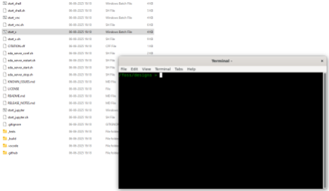

# We are going to use IIC-OSIC Docker image though Docker Desktop. 
The installation process for Docker Desktop varies based on the platform you are using. Please follow the specific instructions for your platform.

## *Step 1:* Navigate to the Docker Desktop [website](https://docs.docker.com/get-started/introduction/get-docker-desktop/) and install the corresponding executables or binaries 
  ### An excellent guide for Windows and Mac is available [here](https://medium.com/@javatechie/docker-installation-steps-in-windows-mac-os-b749fdddf73a)
   <table>
      <tr>
        <td width="15%">
          <h3>Install Docker Desktop on Mac</h3>
          <p>
            <a href="https://docs.docker.com/desktop/setup/install/mac-install">Official Install Guide</a>
          </p>
        </td>
        <td width="30%">
          
        </td>
        <td width="40%">
        </td>
      </tr>
      <tr>
        <td width="15%">
          <h3>Install Docker Desktop on Windows</h3>
          <p>
            <a href="https://docs.docker.com/desktop/setup/install/windows-install">Official Install Guide</a>
          </p>
        </td>
        <td width="30%">
          
        </td>
        <td width="40%">
        </td>
      </tr>
      <tr>
        <td width="15%">
          <h3>Install Docker Desktop on Linux</h3>
          <p>
            <a href="https://docs.docker.com/desktop/setup/install/linux/">Official Install Guide</a>
          </p>
          <ul>
        <li><a href="https://docs.docker.com/desktop/setup/install/linux/ubuntu/">Install on Ubuntu</a></li>
        <li><a href="https://docs.docker.com/desktop/setup/install/linux/debian/">Install on Debian</a></li>
        <li><a href="https://docs.docker.com/desktop/setup/install/linux/rhel/">Install on Red Hat Enterprise Linux (RHEL)</a></li>
        <li><a href="https://docs.docker.com/desktop/setup/install/linux/fedora/">Install on Fedora</a></li>
        <li><a href="https://docs.docker.com/desktop/setup/install/linux/archlinux/">Install on Arch</a></li>
      </ul>
        </td>
        <td width="30%">
          
        </td>
        <td width="40%">
        </td>
      </tr>
      </table> 

## *Step 2:* Open the Docker Desktop app and agree to the Service Agreement and use recommended settings.
   <table>
      <tr>
        <td width="30%">
          <p>
            
          </p>
        </td>
        <td width="30%">
          
        </td>
        <td width="40%">
        </td>
      </tr>
    </table>  
    
    
## *Step 3:* Feel Free to skip the Account Creation dialogue. The skip option is in the top right.  
  <table>
        <tr>
          <td width="30%">
            <p>
              
            </p>
          </td>
          <td width="40%">
          </td>
        </tr>
      </table>  
   

## *Step 4:* Search for **IIC-OSIC-TOOLS** Docker image and pull it (Don’t run). 
   ### Note the `hpretl/iic..` prefix. This step will take some time and disk space on your machine.
  <table>
      <tr>
        <td width="30%">
          <p>
            
          </p>
        </td>
        <td width="40%">
        </td>
      </tr>
    </table>  
   
## *Step 5:* You should see the image name in the `images` (mid-left) in the Docker Desktop Dashboard after the download.
  <table>
      <tr>
        <td width="30%">
          <p>
            
          </p>
        </td>
        <td width="40%">
        </td>
      </tr>
    </table>   
   


## *Step 5:* Navigate to the [JKU-IIC-OSIC-Tools Repository](https://github.com/iic-jku/IIC-OSIC-TOOLS) and download it.
You can download it as Zip too.
<table>
      <tr>
        <td width="15%">
          <p>
            
          </p>
        </td>
        <td width="40%">
        </td>
      </tr>
    </table>  

## *Step 6:*  Now, we will give security permission to Docker to interact with the localhost of the Host OS (your machine where Docker is running). 
This is also platform-dependent.  
  ### Linux/ WSL on Windows  
  - Open a terminal and run `xhost + Local:*`  
  ### Mac  
  - Visit [https://www.xquartz.org/](https://www.xquartz.org/) and download the “Quick Download” file  
  - Once the package is installed, run the installer  
  - Reboot your computer after XQuartz is installed  
  - Launch the XQuartz application
  <table>
      <tr>
        <td width="15%">
          <h3>
            Type in <code>xhost + 127.0.0.1</code>
          </h3>
        </td>
        <td width="30%">
          
        </td>
        <td width="50%">
        </td>
      </tr>
      <tr>
        <td width="15%">
          <h3>
            Go to XQuartz preferences -> Security and check these options
          </h3>
        </td>
        <td width="30%">
          ​​
        </td>
        <td width="50%">
        </td>
      </tr>
      </table>  


## *Step 7:*  Now we are going to build the container from the image. 
The start-up scripts `start_[--].sh` (for Linux/Mac) or “`start_[--].bat` (for Windows) use different ways to build the container. Follow the README at [JKU-IIC-OSIC-Tools Repository](https://github.com/iic-jku/IIC-OSIC-TOOLS) for details about different startup scripts. 

Here, we are going to focus on building the script with VNC and with X11 forwarding, respectively.  
    
### 7.1 **Building with VNC**  
  #### On Linux/Mac  
  - Navigate to the JKU-IIC-OSIC-Tools folder  
  - Open a terminal (or xterm) and execute `./start_vnc.sh`  
    *(Note: you might have to do `chmod +x ./start_vnc.sh`)*

      
      
  - This will create a container named `iic-osic-tools_xvnc_uid_…` and map a folder to the docker with default path being `$HOME/eda/designs` for Linux/macOS and `%USERPROFILE%\eda\designs` for Windows, respectively.
  (i.e. anything you copy/paste to this folder will be visible to the docker).
  - You can map custom folders also using the `DESIGNS` varriable
    ```
    DESIGNS=/my/design/directory ./start_vnc.sh
    ```
  - You can see the newly built container in the `Container` tab (mid-left) in the Docker Desktop Dashboard. Note the container ID. This will be useful later.

     

  - You can now access the Desktop Environment of the OS running in the container through your browser ([http://localhost](http://localhost/)). The default password is **abc123**.  

    
      

  #### On Windows:  
  * With WSL, you can use the same steps as Linux  
  * With standard windows, you can just double-click to execute `start_vnc.bat` and allow permissions.
    
      
  * Then, you can open the desktop environment in your browser ([http://localhost](http://localhost/)). The default password is **abc123**.  
      
### 7.2 **Building with X11**  
X11 forwarding allows the build container to use the Host OS’s display to show graphical images. The Build Procedure is the same, except we will use the `start_x.sh` script (or `start_x.bat` script in case of Windows).    
* Note: `start\_x.sh` script *might* not work in all Linux Distro. See [this issue](https://github.com/iic-jku/IIC-OSIC-TOOLS/issues/135) at the IIC repo. Best Solution at the moment is to fallback to Classical Docker CE in Linux, Instructions [here](https://docs.docker.com/engine/install/ubuntu/).        
* This script should open a terminal in your native display (**not** through a browser window)  

  
* Now you can open graphical applications directly in your native display, for example: Let's try to open Klayout by typing `Klayout&` in the terminal window  

  
  

The difference with VNC and X11 is how Docker Container uses the display. VNC starts a remote display protocol to show the desktop environment of the Container OS that you can view through your browser window, and X11 lets the container use your native display of the host. It runs the CLI interface of the Container, which can be used to start other GUI applications, Klayout, for example, in this case. Either can be used to interact with the applications in a Docker Container. 

